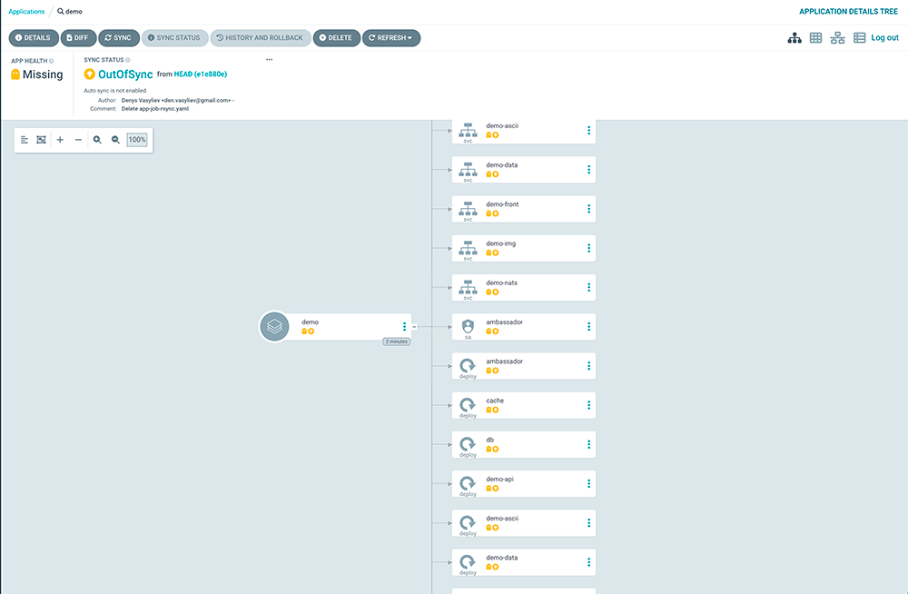

# Minimum viable product

1. Налаштуємо додаток в ArgoCD

- GENERAL
    - Натискаємо + NEW APP
    - Application Name: demo
    - Project Name: default
    - Sync Policy: Manual
    - Ставимо галочку навпроти Auto-Create Namespace


- SOURCE
    - Repository URL: https://github.com/den-vasyliev/go-demo-app
    - Revision: HEAD
    - Path: helm


- DESTINATION
    - Cluster URL: https://kubernetes.default.svc
    - Namespace: demo


2. Натискаємо CREATE в результаті отримаємо наш додаток 


3. Переглянемо деталі розгорнутого застосунку натиснувши на нього в списку.



4. Синхронізація застосунку
- Для цього у вікні відомостей про програму натискаємо кнопку SYNC
- Праворуч вискакує вікно в якому потрібно обрати компоненти та режими синхронізації та натиснути кнопку SYNCHRONIZE
- Після завершення процесу можемо перевірити правильність розгортання програми, перевіривши її статус у кластері:


5. Наш застосунок готовий до роботи, перевіримо його

```sh
$ k port-forward -n demo svc/ambassador 8081:80
Forwarding from 127.0.0.1:8081 -> 80
Forwarding from [::1]:8081 -> 80
```

- в іншому вікні терміналу зробимо запит на вказаний порт та отримаємо відповідь у вигляді версії додатку:

```sh
$ curl localhost:8081
k8sdiy-api:599e1af%
```

- Завантажемо зображення

```
curl -F 'image=@test-image.png' localhost:8081/img/

,,..,,,..,,.,,.,,:,::;;::,:::::,::::,,:,,,,,,::::,,,,...,,.;
,,,,,,...,,...,,,::,:i;::,:::::::::,,,::,::::,:,,,,:::.,,,.;
,,,.......,..,,,,,,,::::::::::;;;;;;;;:::::::::,:,,,,,,,,,.;
,,,,,,,.,.,.,,::,,,,,,,,::,:;;;;iiii1ii;;:::,,,,,,,,,,,,,,.;
,,,,,,,,....,,,,,,,,:;;;:,:::;;iiiii11t11i::,,.,,,,,,,.,,,,;
.,,,,,...,,.,,,,,..,1i:;:,::;;;iiiiii1tt111;,,,...,,,,,,,,:i
...,,.......,,,,,,,:;;;;;:;;;;;;;iiiii11t111;:,,:i,,..,.,,.;
......,,,,.,:,::::,,,,,,:ii;;::;;;;;;;;;i11111i;;1,,.,,,,..;
...........,:,::::,,,,,,,:;;:::::;;;;iii;:1tt1i;:;,,,..,.,.;
......,.....,:,,,,,,,,,:::;;;;;::;;;;ii;;;it1;i1:,,,,,..., :
....,.........,,,,,,,,,:::;;iiii;;;it1;;;;ii;ii:,,,,,,...,.:
...........,,,,,,,,,,::::::;iii11i;itt;;;1t;1f:,,.,,,,....,;
,.......,:,,,,,,,,,,:::::::;;ii1tft1iiiiii11i1t:,..,.,,,,,.;
,.......:,,,,,,,,,:::::::::;;iii1tfft;;iii1tt1f;,,.,.,,,,,.;
;:,:,,:,,,,,,,,,,:::::::::;;;;iii111;:::;;1tttt;::...,,,,,.;
:i;:::::,,,,,,,::::::::;;;;;;;;iiiiii;:,:;;i11;;:::.....,,.:
:;;::;:,::,,,,:::::::::;;;;;ii;;;;ii1111ii1ti:::;:L1,,,... ;
i::;;::::,::,,,::::::::;iiiii;:;;;;ii1ttftft::::;:fGi,,,.,.;
t::;;:::::,::,,,::::::;;;i1i;;;;;;;;;i1ttt1::::;;:iCG:.,.,.;
t::::;:::::,:;;,,::::::;;;ii;;;;iiiii111tt:::;::::iC0t,,...;
i,,::::::,::,:ii:,:::;::;;iii;;;;;iiiii1t:::::::::1CGf,....;
;:,,::::,;;:,,,;1i;:::;;;;;;iiii111111tt::::::::::LCG1,....:
::,,,:,,,::::,,::1f1;::::;;;;;ii11tt1tf;:::::::::tCLC;..,,.;
::,,,:,,:,:,,,,,,:;1ft1i::::::::;;itfL1:::::::::iLLCf,,.,,.;
::.,,,,,,,,,,,,,:,:,:ittf11ii111tfCLti:,,:::::::1CLCi,,.,,.;
;,.,,,,,,,,,,,,,,::::,:;1LCCCCCCCL1;::::::::::;:tCCf:::::;:i
,...,,,,,,,,,,,,,,:::;,..,i1LLLLi,,,:,::::::::::LCCti11ttttf
.....,,,,,,,,,,,,:::::::;i;:,.:,:::::::::::::::1CCC1iiiii1it
```

